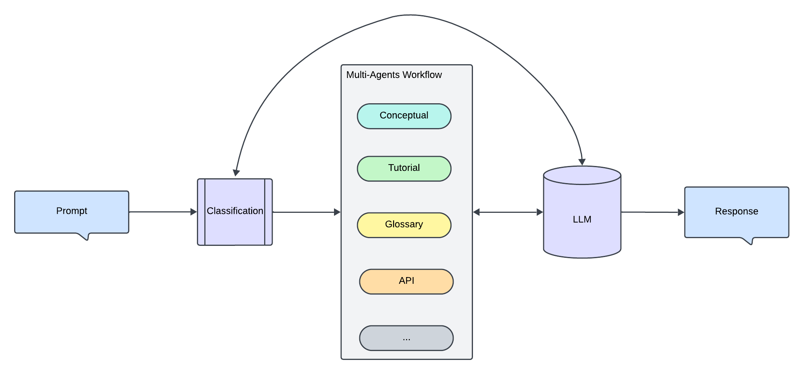

# Doc Multi-Agents Project

This project implements a Retrieval-Augmented Generation (RAG) agent using LlamaIndex and Meta's Llama 3.2 models. 

## Workflow Diagram

## Goals:
- Train and index key aspects of your documentation as specialized bot agents (e.g.: one for conceptual content, another for tutorials and how-tos, and others for terms and glossaries, etc).
- When a user asks a question, the system analyzes the prompt to identify the type of query.
- The right agent (or multiple agents, if needed) is selected to answer specific parts of the prompt.
- The responses from each agent are sent to the LLM, which creates a cohesive, final response.

## Setup
Windows OS:
1. Install Python 3.12.
2. Run `pip install -r requirements.txt` to install dependencies.
3. Create a new virtual environemnt: `python -m venv multiagentsenv`.
3. Activate the virtual environment: `multiagentsenv/Scripts/activate`.
4. Run the Flask agent: `python flask_app.py`...follow instructions in terminal to find the web endpoint for the Agent's Web UI. Start chatting with the Doc Bot Agent from there.

## Features
- Web content ingestion using BeautifulSoup.
- Multiple RAG agents implementation using LlamaIndex.
- LLM using Meta Llama3.2 hosted through HuggingFace Hub
- Web UI (Chat Bot) powered by Flask
